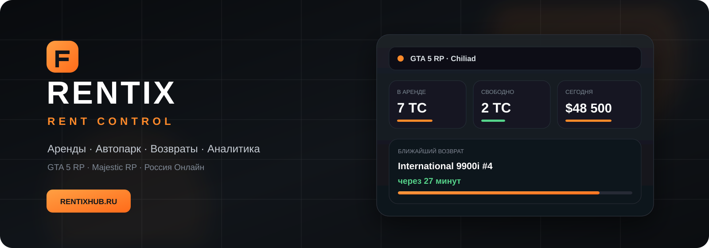
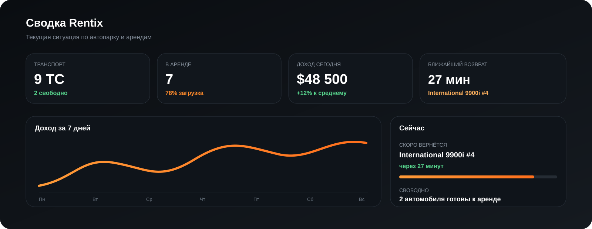
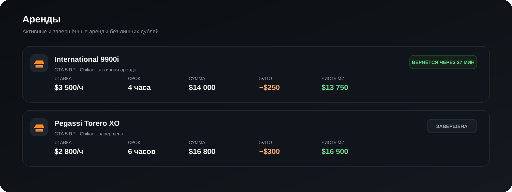
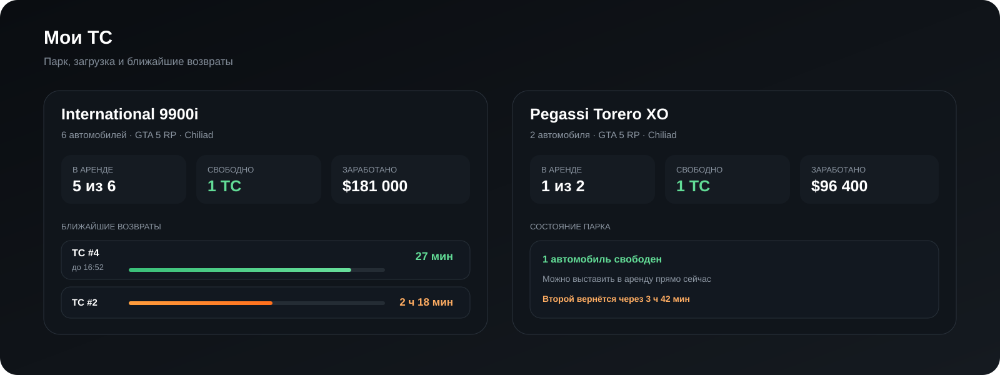

 

**GTA 5 RP · Majestic RP · Россия Онлайн · Web · Windows · Telegram**

---

## 🚘 Что такое Rentix

**Rentix** — сервис для владельцев транспорта на игровых RP-проектах. Он собирает аренды, автопарк, возвраты, доходы, расходы и статистику в одном месте, чтобы не вести учёт вручную в таблицах и сообщениях.

Главная идея: **сдал транспорт — Rentix помогает контролировать всё остальное.**

### Основные возможности

- 🚗 учёт активных и завершённых аренд;
- 🅿️ раздел **«Мои ТС»** с количеством свободных и занятых машин;
- ⏳ таймеры возврата транспорта;
- 💵 цена аренды, стоимость за час, комиссии и чистый доход;
- 📊 статистика по транспорту, периодам и проектам;
- 👥 семейный автопарк и общая статистика;
- 🔔 уведомления о важных событиях и возвратах;
- 🤖 интеграция с Telegram;
- 📥 импорт существующей истории аренд;
- 🖥️ отдельный Rentix Desktop для Windows;
- 🔄 единый аккаунт и синхронизация между сайтом и Desktop.

---

## 🧭 Всё важное на одном экране

Rentix показывает текущую ситуацию по автопарку без необходимости считать вручную: сколько транспорта сейчас в аренде, что уже свободно, когда ближайший возврат и сколько принесли аренды.

Интерфейс сделан так, чтобы основные цифры читались быстро как с компьютера, так и в Telegram Mini App.

---

## 🚗 Аренды

В истории аренды сохраняются транспорт, сервер, срок, ставка, итоговая сумма, комиссия и время возврата.

Для GTA 5 RP Rentix умеет показывать расчёт в понятном виде: **цена за час × срок → сумма аренды → комиссия 5VITO → чистый доход**.

Поддерживаются активные и завершённые записи, поиск, фильтры и подробный просмотр аренды.

---

## 🅿️ Мои ТС

Раздел **«Мои ТС»** помогает быстро понять состояние всего парка. Для каждой модели видно количество экземпляров, сколько машин свободно, сколько находится в аренде, ближайшие возвраты и накопленную статистику.

Таймеры меняют визуальный акцент по мере приближения возврата, поэтому транспорт, который скоро освободится, заметен сразу.

---

## 🎮 Поддерживаемые проекты

| Проект | Возможности |
|---|---|
| **GTA 5 RP** | аренды, 5VITO, серверы, автопарк, возвраты, статистика |
| **Majestic RP** | аренды, транспорт, доходы, статистика |
| **Россия Онлайн** | аренды, транспорт, доходы, статистика |

Для GTA 5 RP актуальные серверы отображаются отдельно от архивных. Закрытые серверы сохраняются в истории, но не смешиваются с текущими данными.

---

## 🤖 Telegram и Mini App

Rentix связан с Telegram: уведомления об арендах и важных событиях приходят без необходимости постоянно держать сайт открытым.

Mini App использует тот же аккаунт и те же данные, что и основной Rentix, поэтому аренды, транспорт, статистика, семья, уведомления и профиль доступны с телефона.

---

## 🖥️ Rentix Desktop

**Rentix Desktop** — Windows-клиент для тех, кто постоянно работает с арендой транспорта. Он использует тот же аккаунт и актуальную базу Rentix: можно начать работу на сайте и продолжить в приложении.

Desktop-клиент включает аренды, «Мои ТС», статистику, уведомления, настройки и синхронизацию с RentixHub.

> Публичный репозиторий Rentix используется как витрина проекта, документация, история обновлений и место для обратной связи. Исходный код сервиса и Desktop-клиента здесь не публикуется.

---

## ⚡ Последние изменения

- 🏔️ добавлена корректная поддержка нового сервера **Chiliad** в GTA 5 RP;
- 🗃️ закрытые GTA 5 RP серверы скрыты из актуальных данных без удаления истории;
- 💵 добавлено отображение **стоимости аренды за 1 час**;
- 🅿️ обновлены карточки и состояния транспорта в **«Мои ТС»**;
- ⏳ переработаны таймеры возврата транспорта;
- 🧹 убраны дублирующиеся финансовые показатели в арендах GTA 5 RP;
- 🚀 ускорена загрузка основных разделов, профиля, семьи и Telegram Mini App;
- 📥 большие импорты обрабатываются в фоне и меньше блокируют интерфейс.

Полная история изменений: **[CHANGELOG.md](CHANGELOG.md)**.

---

## 🌐 Открыть Rentix

### [🚘 rentixhub.ru](https://rentixhub.ru)

Один аккаунт для сайта, Telegram Mini App и Rentix Desktop.

---

## 👨‍💻 Разработчик и новости

**Rentix:** [t.me/rentixgta](https://t.me/rentixgta)  
**Канал разработчика:** [t.me/shim0ryw](https://t.me/shim0ryw)  
**Контакт:** [@shimoryw](https://t.me/shimoryw)

---

## ❤️ Поддержать проект

Если Rentix экономит время и хочется поддержать дальнейшую разработку, это можно сделать добровольно через Telegram-счёт.

Счёт можно оплатить **анонимно**, при желании добавить комментарий. Поддерживаются:

`USDT` · `TON` · `SOL` · `BTC` · `DOGE` · `LTC` · `ETH` · `BNB` · `TRX` · `USDC`

Поддержка добровольная и не является обязательным условием использования Rentix.

---

## ❓ FAQ

<b>Нужно ли вручную вести каждую аренду?</b>

 
Rentix старается максимально сократить ручную работу: часть данных может приходить из подключённых интеграций, а существующую историю можно импортировать. При необходимости записи можно корректировать вручную.

<b>Что происходит со статистикой закрытых серверов GTA 5 RP?</b>

 
Она не удаляется. Архивные серверы скрываются из актуального представления, поэтому старые аренды не смешиваются с текущей статистикой.

<b>Сайт и Desktop используют разные данные?</b>

 
Нет. Rentix Desktop работает с тем же аккаунтом и данными RentixHub.

<b>Можно ли использовать Rentix с телефона?</b>

 
Да. Основной веб-интерфейс адаптирован под мобильные устройства, а ключевые возможности доступны через Telegram Mini App.

<b>Исходный код открыт?</b>

 
Нет. Этот репозиторий предназначен для публичной страницы проекта, документации, истории изменений и обратной связи. Исходный код Rentix не публикуется.

---

## 🐞 Нашли ошибку или есть идея?

Создайте обращение через **Issues**. Для ошибки желательно указать проект, раздел Rentix, что происходило перед проблемой и приложить скриншот, если он помогает воспроизвести ситуацию.

[Сообщить об ошибке](https://github.com/shimoryw/rentix/issues/new/choose) · [Предложить улучшение](https://github.com/shimoryw/rentix/issues/new/choose)

  

**RENTIX — RENT CONTROL**  
*Аренда под контролем.*

